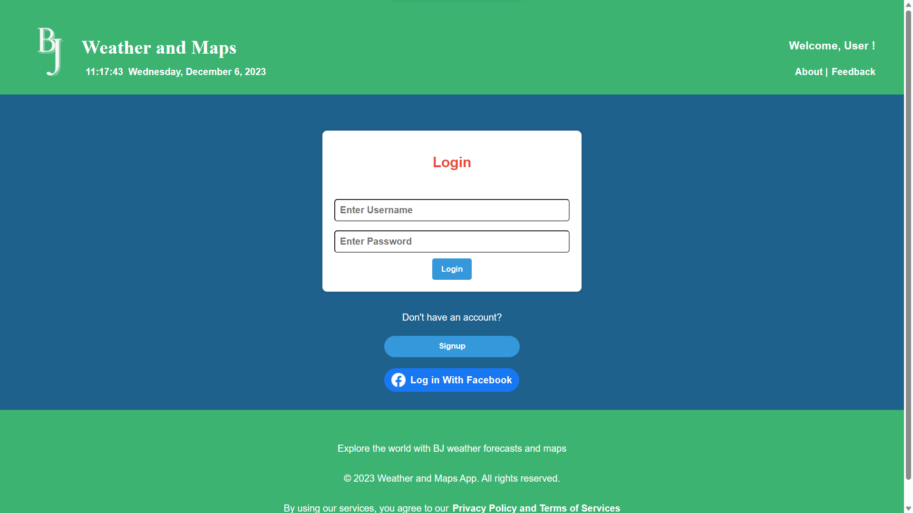
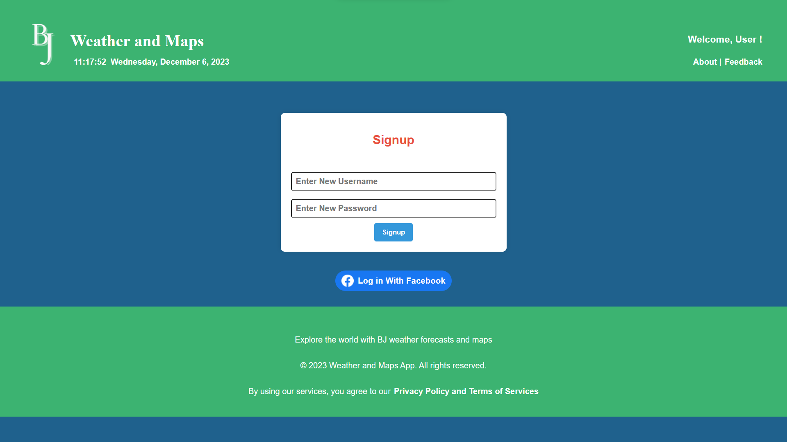
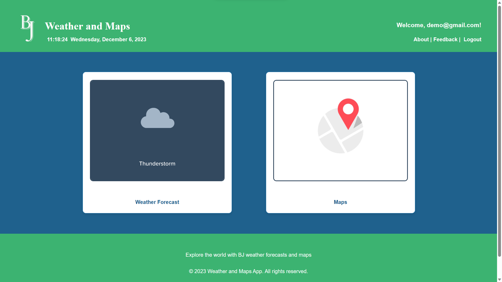
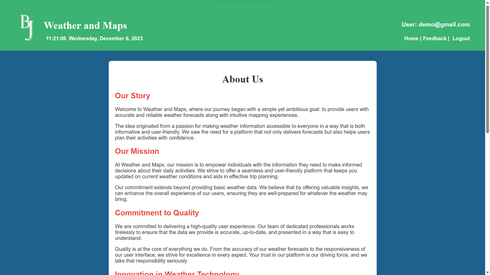
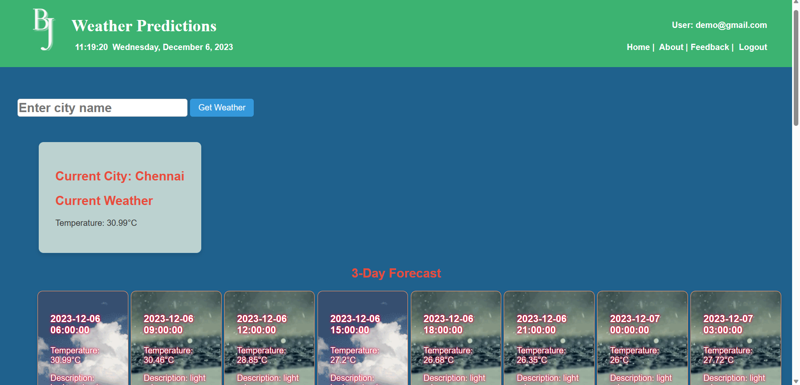
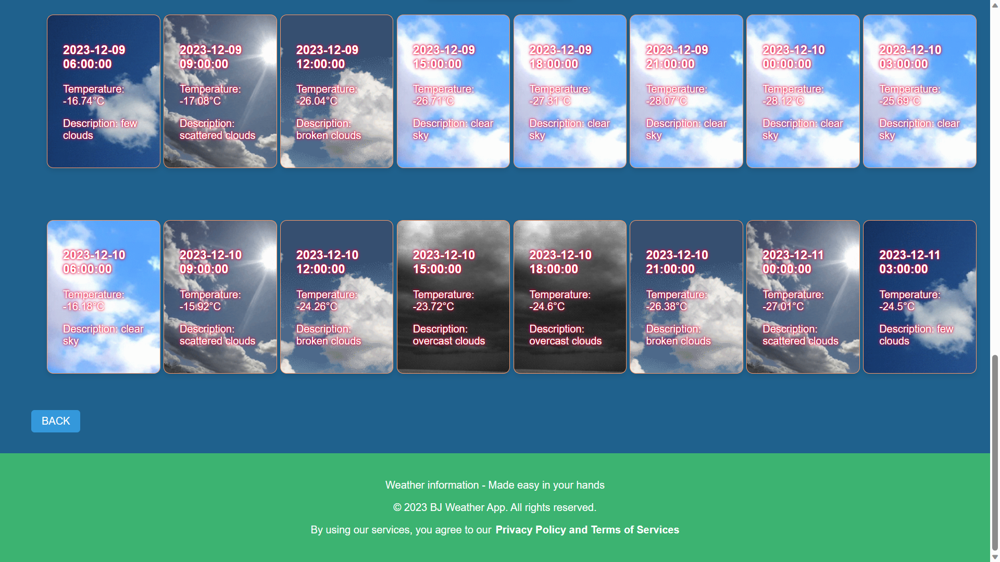
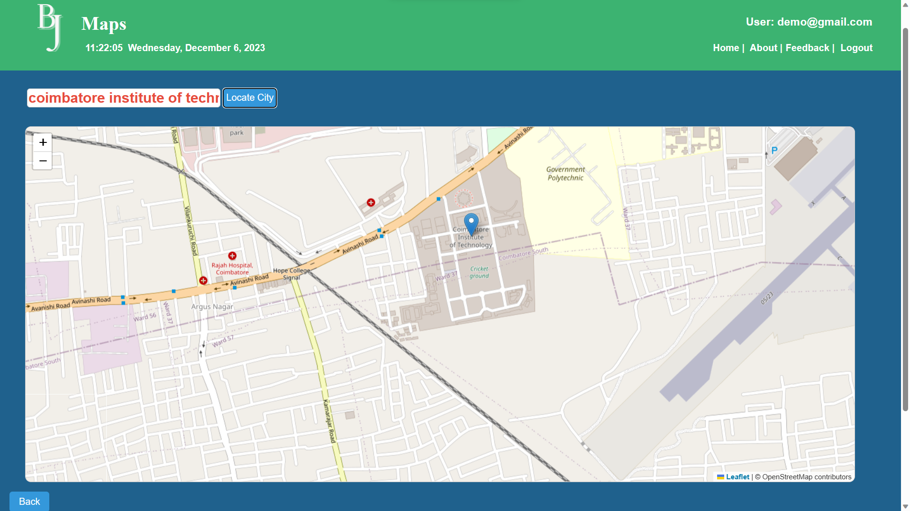
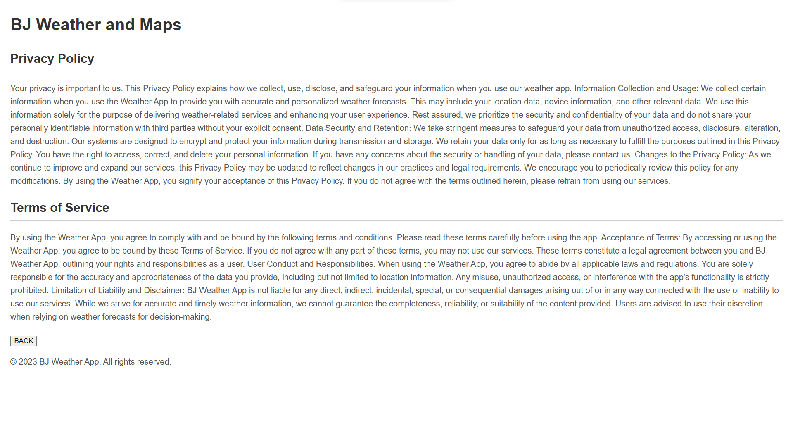
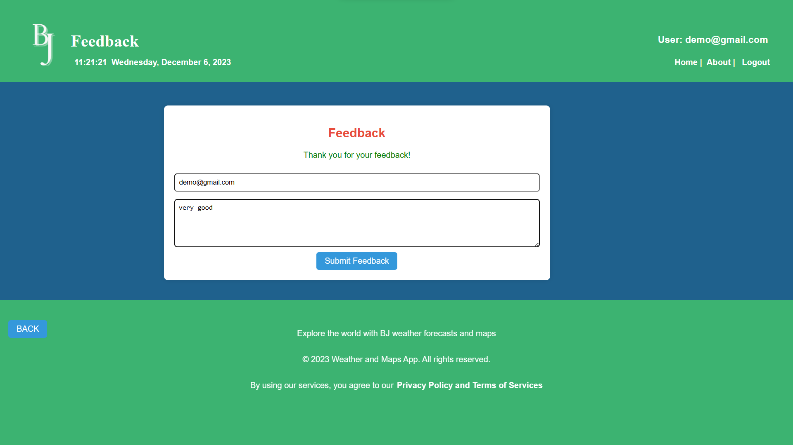

# Weather and Map Application using Django

This project is a web application developed using Django, a powerful Python framework, to provide users with up-to-date weather data for any location worldwide. The application aims to be user-friendly, accessible, and visually appealing, catering to a wide range of users.

## Aim
The aim of this project is to create a user-friendly and comprehensive weather application using Django that delivers accurate and real-time weather information for any location worldwide. The application should cater to a diverse range of users, including those with varying levels of technical expertise.

## Tech Stack
Django: A Python web framework that encourages rapid development and clean, pragmatic design.
HTML: Used for structuring the content of web pages.
CSS: Used for styling the HTML content and providing a visually appealing layout.
JavaScript: Used for client-side scripting. In this project, it's included through the app.js file.
AJAX (Asynchronous JavaScript and XML): Although not explicitly shown in the provided code, Django projects often use AJAX for asynchronous communication between the client and server, allowing dynamic updates without requiring a full page reload.
MongoDB: Django uses MongoDB as the database for development purposes.
Weather API (assumed): Since this project is related to weather forecasting, it's likely that a weather API is used to fetch weather data. The code for this interaction is not shown, but it's common in such projects.

## Features
Display current temperature, humidity, precipitation, and wind conditions for any specified location.
User-friendly search function to easily find and select the desired location, potentially incorporating a search bar, autocomplete functionality, or interactive maps.

## Screenshots

Login Page

Signup Page

Home Page

About Us

Weather Details

Map Details

Privacy Policy

Feedback Form

## Setup Instructions

Clone the repository: git clone https://github.com/yourusername/yourrepository.git

Install the required dependencies: pip install -r requirements.txt

Run the development server: python manage.py runserver

Access the application in your web browser at http://localhost:8000

## Usage
Use the WeatherProject Folder

## Contribution Guidelines

Fork the repository

Create a new branch (git checkout -b feature/yourfeature)

Commit your changes (git commit -am 'Add new feature')

Push to the branch (git push origin feature/yourfeature)

Create a new Pull Request

## License
This project is licensed under the MIT License - see the LICENSE file for details.
